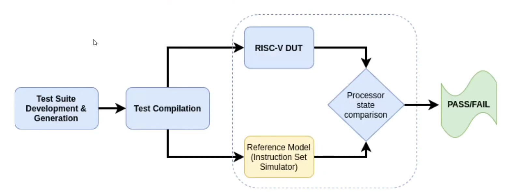
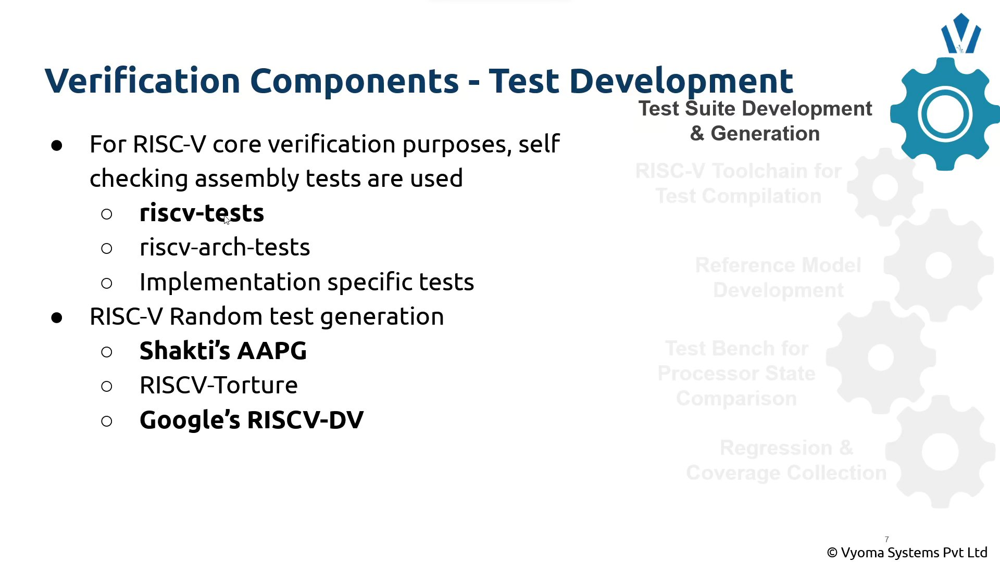
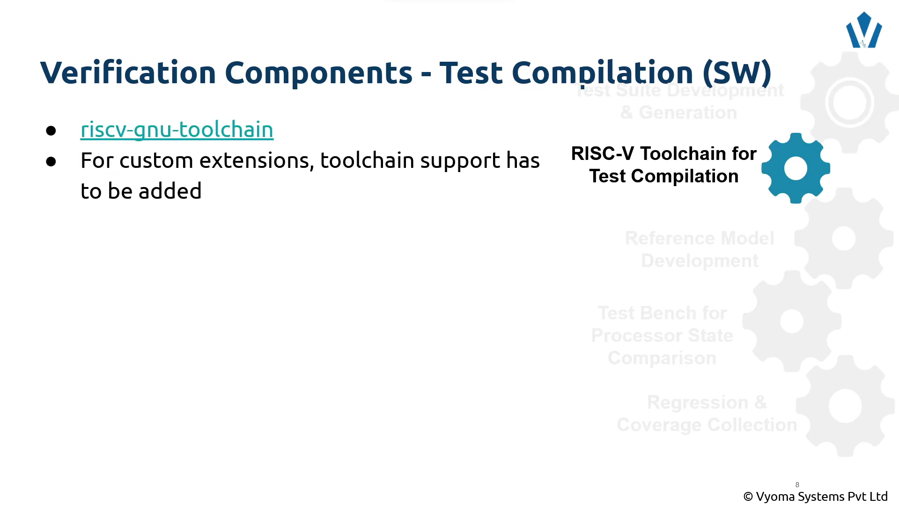
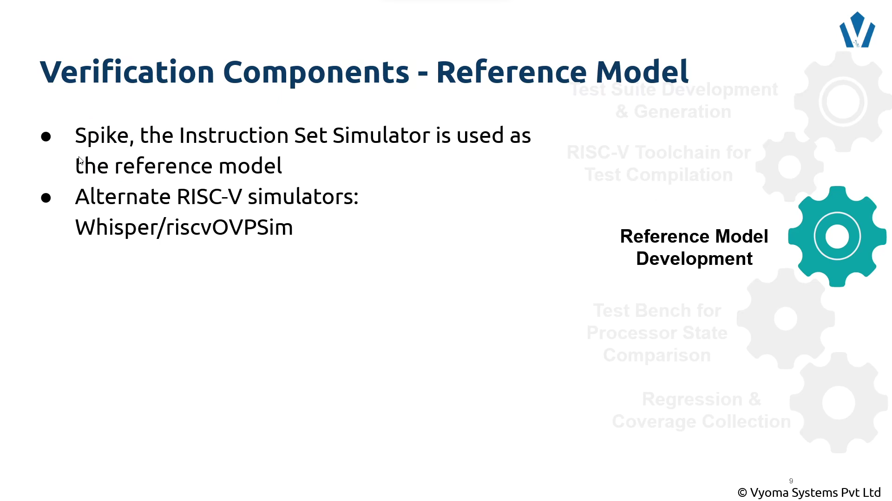
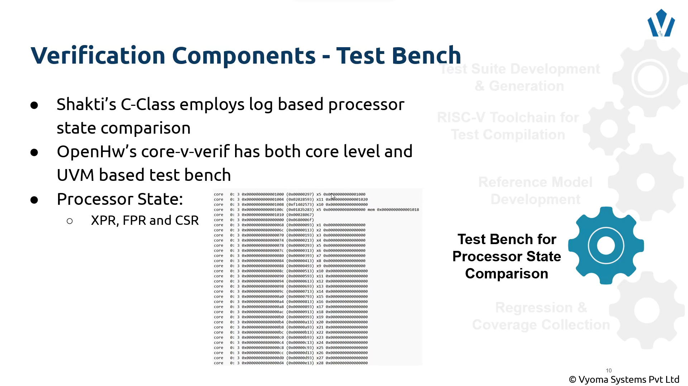
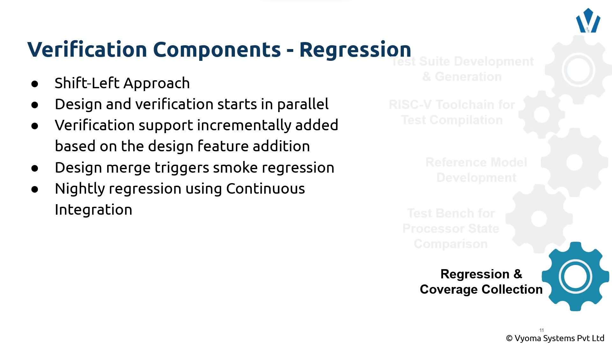
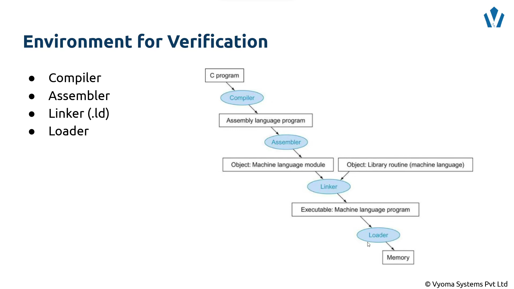

# RISCV CTB Hackathon 2023

## Introduction

This repository contains the various bug fixes and related documentation for the various challenge levels in the Hackathon.
I chose **riscv buggy** as my preferred design in the *part 3*.

## Contents
* Introduction
* Project Execution Details
* Challenge Level 1
    - Introduction
    - Challenge 1 logical
    - Challenge 2 loop
    - Challenge 3 illegal
* Challenge Level 1
    - Introduction
    - Challenge 1 instructions
    - Challenge 2 exceptions
* Challenge Level 3
    - Introduction
    - Directed Tests
    - Random Tests
    - RISCV
    - RISCV - DV Coverage

## Project Execution Details
**The Verification Plan**




**The details of Verification Process**







**The Compilation Procedure**



## Challenge Level 1
### Introduction
In this level, we were asked to work on directed tests on **rv32i** ISA. This involved finding faults in riscv assembly tests and debugging them to run them effectively on a reference ISA simulator - *Spike*. Each subchallenge contained an assembly file and a Makefile to run the assembly on Spike.

### Challenge 1 logical
There were two bugs in the assembly file. Both of the bugs are commented and new code was written it the next line

1. 1<sup>st</sup> bug

* **Code**
```
# Faulty code
and s7, ra, z4
# Corrected code
and s7, ra, s4
```
* **Explanation**

*z4* is not a defined register in riscv documentation. Hence it throws an error

* **Snapshot**


2. 2<sup>nd</sup> bug

* **Code**
```
# Faulty code
and a3, s0, s7
# Corrected code
andi s5, t1, 0
```
* **Explanation**

*andi* is an i-type instruction, hence the second operand should be an immediate (sign extended 12 bit value)

* **Snapshot**


### Challenge 2 loop

* **Problem**

The code ran for infinite time without stopping.

* **Before - Code**
```
loop:
  lw t1, (t0)
  lw t2, 4(t0)
  lw t3, 8(t0)
  add t4, t1, t2
  addi t0, t0, 12
  beq t3, t4, loop        # check if sum is correct
  j fail

```

* **Before - Snapshot**


* **After - Code**
```
loop:
  beq t5, x0, test_end     # check if t5 is equal to 0 -> run 3 times => t5 = 3,2,1
  lw t1, (t0)
  lw t2, 4(t0)
  lw t3, 8(t0)
  add t4, t1, t2
  addi t0, t0, 12
  addi t5, t5, -1         # after every iteration decrement t5 by 1
  beq t3, t4, loop        # check if sum is correct
  RVTEST_PASS
  j fail

```

* **After - Snapshot**


* **Explanation**

The code is loading data into t1, t2 and t3. At every iteration, it is checking whether the *sum* (given in data section of assembly - t3) and the addition of t1 and t2 is the same or not. Although, it was intended to be a *for* loop, no iterator was given.*t5* was initialized to 3 beforehand in the code. I designated the iterator to be *t5*, and decremented it by 1 after every iteration step. Also before every iteration, I checked whether t5 was equal to 0. If yes, then terminate the loop.

### Challenge 3 illegal

* **Problem**

The code was about creating a trap handler for exception handling scenarios. But it was buggy, which made it trapped in an infinite loop.

* **Before - Code**
```
illegal_instruction:
  .word 0              
  j fail
  TEST_PASSFAIL

  .align 8
  .global mtvec_handler
mtvec_handler:
  li t1, CAUSE_ILLEGAL_INSTRUCTION
  csrr t0, mcause
  bne t0, t1, fail
  csrr t0, mepc

  mret
``` 

* **Before - Snapshot**


* **After - Code**
```
illegal_instruction:
  .word 0
  # j fail                                # before it was pointing to  fail, whereas it had to point to mtvec_handler 
  j mtvec_handler                         # changed jmp message from fail to mtvec_handler label

  .align 8
  .global mtvec_handler

  # -------------------Before-------------------
# mtvec_handler:
#   li t1, CAUSE_ILLEGAL_INSTRUCTION      # load the exeption code into t1
#   csrr t0, mcause                       # load the exeption code into t0, not by macro but by mcause reg
#   bne t0, t1, fail                      # if both codes are different, then your program has failed
#   csrr t0, mepc                         # read the mepc reg content (exeption instruction's address)

# If you directly write mret before changing the mepc reg, then it will again return to the same instruction that caused an exeption
#   mret

 # -------------------After-------------------
mtvec_handler:
  li t1, CAUSE_ILLEGAL_INSTRUCTION      # load the exeption code into t1
  csrr t0, mcause                       # load the exeption code into t0, not by macro but by mcause reg
  bne t0, t1, fail                      # if both codes are different, then your program has failed
  csrr t0, mepc                         # read the mepc reg content (exeption/interrupt instruction's address)
  addi t0, t0, 4
  csrw mepc, t0
  RVTEST_PASS
  mret

  fail:                                 # added fail command to ensure fail message is delivered
  RVTEST_FAIL
```

* **After - Snapshot**


* **Explanation**

The mepc reg in riscv contains the address of the instruction, which caused an exception. If you directly write mret before changing the mepc reg, then it will again return to the same instruction that caused an exeption, thus causing the code to again return back to the trapped instruction.

I added 4 to the mepc register before mret, so that it would move to the next instruction in memory.

Another bug here was that, when illegal instruction function was called it jumped to fail, I rewrote it to mtvec_handler for appropriate error handling

## Challenge Level 2

### Introduction
In Level 2, we were asked to debug Shakti AAPG random generator, to generate random instructions, generated by certain limitations set by the config .yaml file. The config file had to be run with the help of a makefile, which converted it to assembly, linked it with other scripts, and compiled it. It was later run on Spike.

### Challenge 1 - instructions

* **Problem**

On running the makefile, error - *Opcode not recognized* came out.

* **Before - Code**
```
rel_rv64m: 10
```

* **Before - Snapshot**


* **After - Code**
```
rel_rv64m: 0
```

* **After - Snapshot**


* **Explanation**

Since, we are testing it on a *rv32i* type ISA, we can't have any rv64 supported instructions. In this case it was taking *divw* and *mulw* type instructions, which are purely rv64 based.

### Challenge 2 - exceptions

* **Task**

We were asked to generate 10 illegal exceptions with their correct handler code.

* **Code**
```
exception-generation:
  ecause00: 10
```

* **Snapshot**


* **Assembly file snapshots**


* **Explanation and Inference**

By the above screenshots we notice that AAPG compiled to generate 10 exceptions with the handler code of 00. Going by the riscv Prviledged Specification, this is due to the Instruction address misaligned, which is an illegal exception. 

I also have attached screenshots, listing that 10 exceptions were truly generated. Random ensures that they are randomly distributed - they are not in ascending or descending order.

## Challenge Level 3

* **Introduction**

In the first part, we were given a buggy design - '*riscv_buggy*', a rv32i core. We had to find and expose all bugs in the design.

In the second part, we had to generate a coverage report of the given design, in a text file. But, several directories and files were missing. We had to figure out a way to generate the coverage report.

#### 1<sup>st</sup> part
* **Approach**

I first tweaked various portions of *AAPG* random instruction generator, to narrow down which portion of the processor was buggy. Then based on the errors, I wrote directed tests.

* **AAPG test which generated bugs in core**


* **Error observed**

The error message -


Backtracking the instructions, which caused the errors


* **Directed tests**


As we can see, *or* leads to errors, which makes our guess correct.

* **Data Hazard Verification**

Code - 


Result - 


* **Inference**

Since, all the instructions  are working correctly except the *or* and the *ori* instruction, we can conclude that the only part which is buggy is the ALU, specifically the *or* part.

Since, all the stages of the core are working fine, also the hazard mitigation part as seen in the data hazard evaluation section, we conclude that *or* and *ori* in the ALU is the only buggy part.

#### 2<sup>nd</sup> part

* **Directory Structure**


* **Approach**

Upon running the given commands in the README file, it was not generating the *CoverageReport.txt* file. From the [RISCV-DV](https://github.com/chipsalliance/riscv-dv/tree/master/pygen/pygen_src) GitHub repo, I followed the commands given there. On running the commands, there were some missing files which needed to be installed. On installing those and running other files were needed as well. On doing this recursively, the program finally ran.

For obtaining **100%** coverage, make the directory structure (except cov_out_2023-07-30 and out_2023-07-30, these are automatically generated) as given. Then run these commands

```
$source setup.sh
$cd challenge_level3/riscv_dv_coverage/
$run --target rv32i --test riscv_arithmetic_basic_test --testlist testlist.yaml --simulator pyflow
$python3 cov.py --dir out/spike_sim/ --simulator=pyflow --enable_visualization
```

The coverage report shall be created in the *cov_out_2023-07-30* directory under the name of *CoverageReport.txt*.